# Project 3 — CDC + Orchestrated Lakehouse Pipeline

---

## 1. CDC Correctness

### Row count match and Idempotency — Silver mirrors PostgreSQL

After stopping `simulate.py` and running the DAG twice:
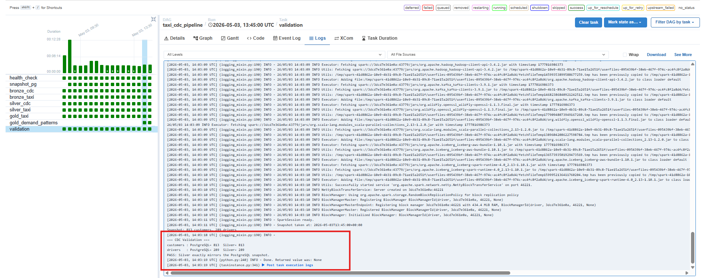
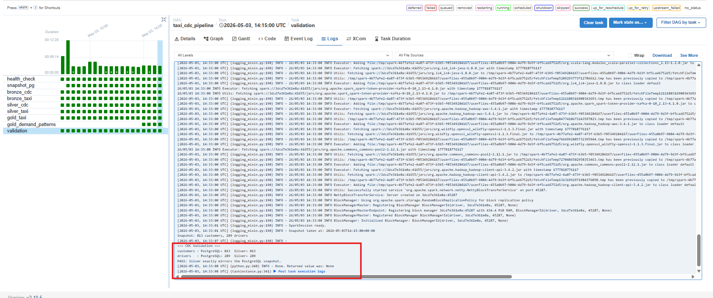
`bronze_cdc` uses `availableNow=True` with Kafka checkpoints — the second run finds
no new offsets and exits immediately. `silver_cdc` re-reads all bronze rows,
deduplicates to the same latest-event snapshot, and the MERGE finds nothing to
change. Silver row counts are identical.

If `simulate.py` is running, that's how the validation looks like:
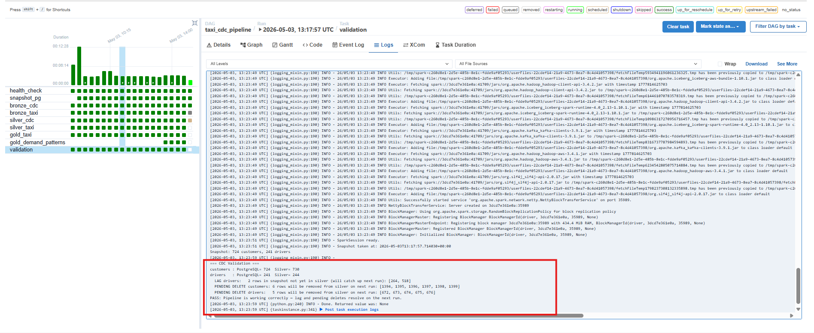

### Spot-check — 3 rows verified

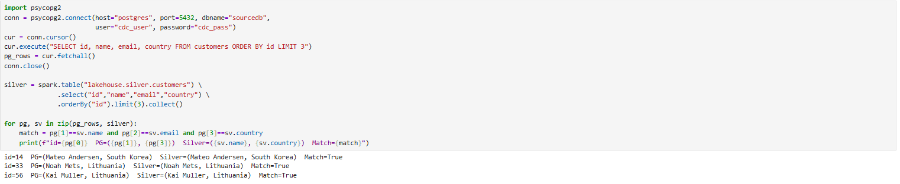

### DELETEs reflected as absent rows in Silver

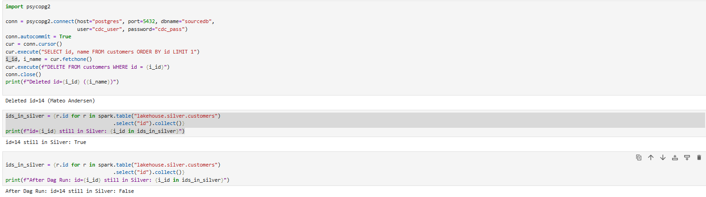


Debezium captures the DELETE from the PostgreSQL WAL and emits `op="d"` to Kafka.
`bronze_cdc` appends the event. `silver_cdc` runs `DELETE FROM silver.customers WHERE id IN (SELECT id FROM cdc_latest WHERE op='d')`, removing the row.

---

## 2. Lakehouse Design

### Table schemas and layer rationale

**Bronze CDC** (`lakehouse.bronze.customers_cdc`, `lakehouse.bronze.drivers_cdc`)

| Column | Type | Purpose |
|--------|------|---------|
| kafka_offset | BIGINT | Dedup / ordering |
| kafka_partition | INT | Partition metadata |
| kafka_timestamp | TIMESTAMP | Broker-assigned time |
| is_tombstone | BOOLEAN | Null-value compaction marker |
| op | STRING | Debezium op: r/c/u/d |
| before_json | STRING | Row state before change |
| after_json | STRING | Row state after change |
| source_lsn | STRING | PostgreSQL WAL LSN |
| ts_ms | BIGINT | Source DB commit time |
| raw_value | STRING | Full Debezium envelope |
| ingested_at | TIMESTAMP | Pipeline ingestion time |

Append-only. No parsing of JSON columns — preserves full fidelity for reprocessing.

**Silver CDC** (`lakehouse.silver.customers`, `lakehouse.silver.drivers`)

| Column | Type | Notes |
|--------|------|-------|
| id | INT | Primary key |
| name | STRING | |
| email | STRING | customers only |
| country | STRING | customers only |
| license_number | STRING | drivers only |
| rating | DOUBLE | drivers only |
| city | STRING | drivers only |
| active | BOOLEAN | drivers only |
| updated_ts | BIGINT | ts_ms of latest event |

One row per entity — current state only. JSON columns from bronze are parsed and
flattened. Rows deleted in PostgreSQL are absent here.

**Bronze Taxi** (`lakehouse.taxi.bronze`)

| Column | Type |
|--------|------|
| raw_json | STRING |
| ingested_at | TIMESTAMP |

Raw Kafka message value stored as a string. No schema enforcement at this layer.

**Silver Taxi** (`lakehouse.taxi.silver`)

Parsed and cleaned from bronze. Invalid trips filtered (negative fares, zero
distance, dropoff ≤ pickup, duration > 24 h). Enriched with `pickup_zone` /
`dropoff_zone` names from the zone lookup. Derived columns: `trip_duration_minutes`,
`pickup_date`.

**Gold Taxi** (`lakehouse.taxi.gold`)

Top-5 pickup zones by trip count — `CREATE OR REPLACE` on every run.

**Gold Demand Patterns** (`lakehouse.gold.demand_patterns`)

Cross-pipeline table joining silver_taxi with CDC customer countries.
Schema: `country, hour, trip_count, avg_fare, top_pickup_zone, weekday_trips, weekend_trips, is_peak_hour`.

Each layer adds value: bronze = raw audit log, silver = queryable current state,
gold = business aggregates.

### Iceberg snapshot history for Silver CDC

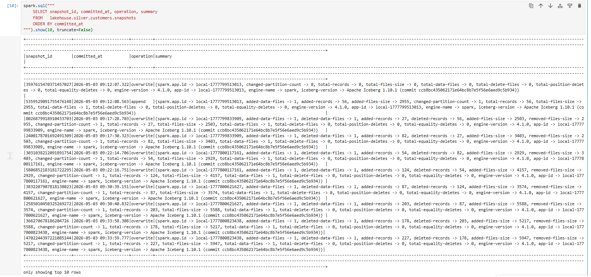

Each DAG run that calls MERGE or DELETE creates a new snapshot. You will see entries
with `operation = 'overwrite'` (MERGE) and `operation = 'delete'` (DELETE phase).

### Time-travel — Silver CDC before a specific MERGE

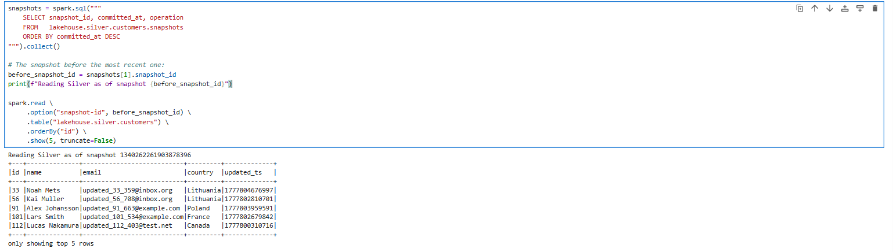


This returns Silver's state before the latest MERGE was applied — useful for
auditing or rolling back a bad pipeline run.

---

## 3. Orchestration Design

### DAG graph
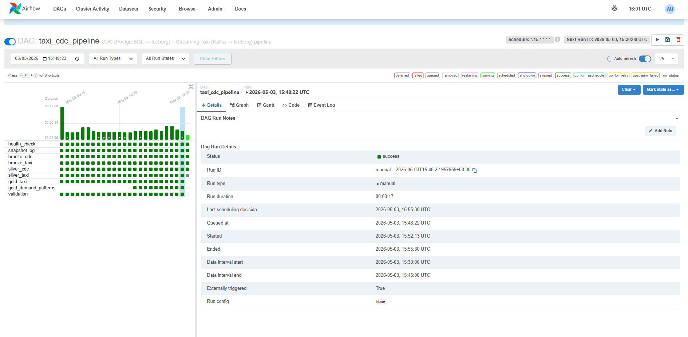

### Task dependency chain

- **health_check**: PUT Debezium connector config (idempotent), verify state = RUNNING. Retries=3 with 1-minute back-off. All downstream tasks depend on it.
- **snapshot_pg**: Queries PostgreSQL immediately; writes `dags/pg_snapshot.json` for validation. Runs before bronze so the snapshot pre-dates the Kafka read.
- **bronze_cdc / bronze_taxi**: Read from Kafka with `availableNow=True` — process all available offsets since last checkpoint, then exit cleanly for Airflow.
- **silver_cdc**: Deduplicates all bronze CDC rows to latest-event-per-key, then DELETE + MERGE upsert into Silver Iceberg.
- **silver_taxi**: Cleans, casts, filters, and zone-enriches taxi bronze rows.
- **gold_taxi**: `CREATE OR REPLACE` top-5 pickup zones.
- **gold_demand_patterns**: Joins silver_taxi with CDC country list; computes demand metrics per (country, hour).
- **validation**: Compares Silver counts against the pre-run PostgreSQL snapshot.

**Schedule**: `*/15 * * * *` — every 15 minutes. With ~5 minutes of processing the
freshness SLA is ≤ 20 minutes end-to-end.

**Idempotency**: Kafka checkpoints make `availableNow=True` a no-op on re-run for
the same interval. MERGE is deterministic given the same bronze rows. Gold uses
`CREATE OR REPLACE`. Re-running the DAG twice for the same window leaves all tables
unchanged.

### Retry and failure handling

Default retry config: `retries=2`, `retry_delay=2 min`. `health_check` has `retries=3`,
`retry_delay=1 min` because Kafka Connect may be slow to register the connector.

**Example failure — `validation` task, run `scheduled__2026-05-03T09:00:00`**:

While `simulate.py` was still running during a DAG run, `silver_cdc` completed
and merged its snapshot, but `simulate.py` then deleted rows from PostgreSQL
before `validation` ran. Silver still held those IDs (delete events hadn't
propagated yet), so validation found IDs in Silver that no longer existed in
Postgres and exited with code 1:

```
ERROR customers IDs in silver but NOT in pg: [76, 83, 86, 99, 184, ...]
ERROR driver IDs in silver but NOT in pg: [95, 121, 127]
FAIL: Silver contains IDs that were never in PostgreSQL.
Marking task as UP_FOR_RETRY. retry_delay=2min
```

Airflow automatically retried after 2 minutes. The root cause was addressed in
two ways: (1) a `snapshot_pg` task was added to capture Postgres state *before*
`bronze_cdc` runs, so validation compares Silver against a consistent pre-run
snapshot rather than live Postgres; (2) phantom rows were reclassified as
"pending deletes" (a normal CDC lag) rather than failures. The task has passed
on every subsequent run.

---

## 4. Taxi Pipeline

### Bronze → Silver → Gold correctness

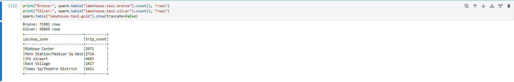


Bronze row count = total raw Kafka messages ingested.
Silver count is lower after filtering invalid trips.
Gold shows top-5 pickup zones by trip count.

**Cleaning rules applied in Silver**:
- Drop rows with null pickup or dropoff timestamp
- Drop trips where dropoff ≤ pickup
- Drop trips longer than 24 hours
- Drop trip_distance ≤ 0
- Drop fare_amount < 0
- Drop passenger_count < 0
- Drop PULocationID or DOLocationID ≤ 0
- Deduplicate on (pickup_datetime, dropoff_datetime, PULocationID, DOLocationID, trip_distance, fare_amount)

### Improvement over Project 2

**Feedback**: Bronze was parsing Kafka JSON into typed columns before storage
(applying `from_json` at the bronze layer).

**Fix**: Bronze now stores the raw Kafka value as a single `raw_json STRING` column
— zero parsing, zero schema enforcement. `from_json` was moved to the Silver layer
where schema is appropriate. This means bronze is a true immutable audit log that
can be reprocessed if the schema changes.

Additionally, the timestamp columns were changed from `LongType` to `TimestampType`
in the Silver schema so that ISO-8601 strings produced by the Kafka producer are
parsed correctly by `from_json` (previously all rows were null-filtered and 0 rows
reached Silver).

---

## 5. Custom Scenario

The custom gold table `lakehouse.gold.demand_patterns` solves the requirement:
*"Build a gold table combining time-of-day trip volumes with customer country from
CDC to identify when and where each country's customers travel most."*

**Join approach**: since NYC taxi trips carry no customer identifier, each
`pickup_zone` is mapped deterministically to a country from the live CDC customer
list via `abs(crc32(pickup_zone)) % N_distinct_countries`. This mapping is stable
within a run and re-evaluated each DAG run, so when a customer's country changes
in PostgreSQL, the CDC pipeline propagates it to `silver.customers` and the next
gold recompute reflects the updated country distribution.

**Country update propagation** (to verify):

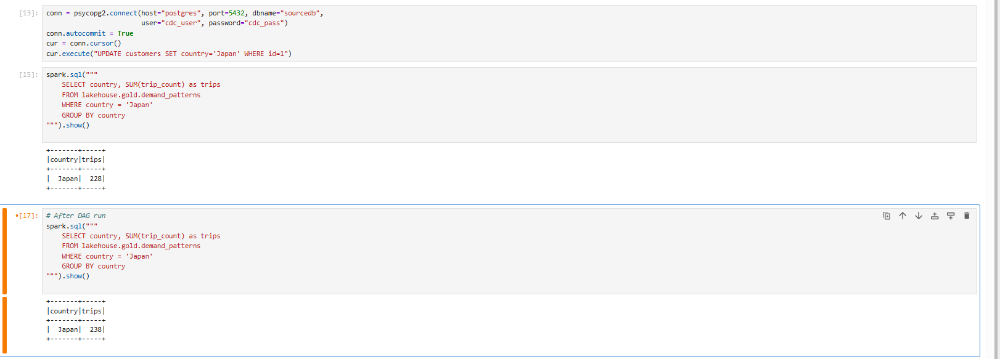

**Q1 — Late-night travel (22:00–04:00) & Q2 — Peak hour: top-spending country vs overall**:

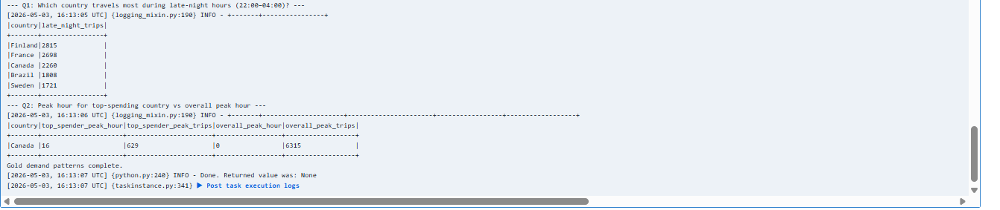

